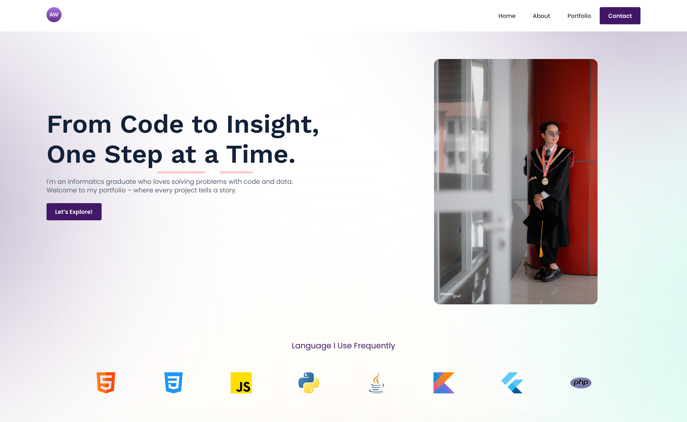

# **Personal Portfolio Website**

Welcome to my personal portfolio website!  
Built with **Tailwind CSS** and fully responsive, this site showcases who I am, what I do, and the projects I've worked on — from mobile apps to AI systems.

## ✨ About Me
I'm a fresh graduate majoring in Informatics, passionate about turning ideas into meaningful digital solutions. My interests span across **Mobile Development**, **Web Development**, and **Data Science** — where I enjoy building, analyzing, and learning continuously.

## 🛠️ What I Used
- **Tailwind CSS** – For responsive and utility-first styling  
- **HTML5** – Semantic and clean structure  
- **Custom Google Fonts** – For modern look and readability  

## 🚀 Sections Included
- Hero section with call-to-action  
- About Me and What I Do  
- Programming Languages I use  
- Highlighted Projects (Portfolio)  
- Contact section

---

📫 **Interested in working together or learning more?**  
Feel free to reach out and [visit my LinkedIn profile](https://www.linkedin.com/in/alfiessa) for more info and updates.
